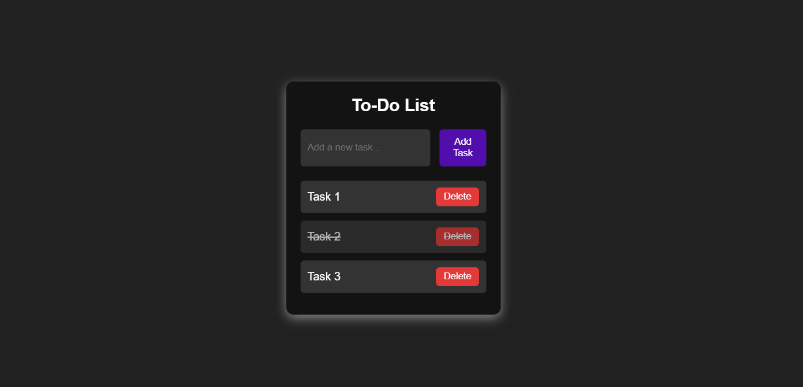

# miniToDo

## 🚀 Overview
Mini Project : 
A simple To-Do List web application that allows users to add, delete, and mark tasks as completed. Built with HTML, CSS, and JavaScript.

### Run Locally:
1. Clone the repository:
   ```sh
   git clone https://github.com/your-username/todo-list.git


